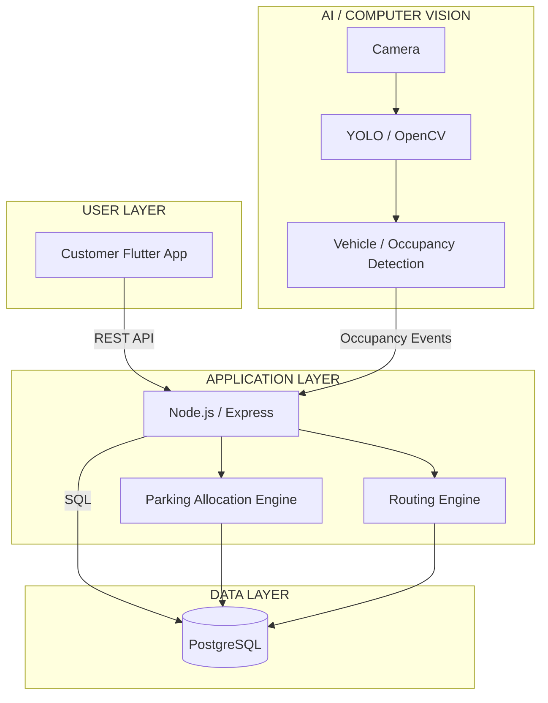

# ParkEase

### Intelligent Parking Management System

ParkEase is a prototype intelligent parking management system designed to simplify parking in commercial buildings with multiple entrances.

It combines parking-slot allocation, graph-based indoor navigation, centralized parking-state management, and computer vision for vehicle and parking-occupancy monitoring.

---

## Overview

ParkEase digitally models a parking facility using its floor plan. Parking slots, entry/exit points, building entrances, junctions, and internal roads are represented as a connected graph.

When a customer enters the facility and selects a destination, ParkEase identifies a suitable available parking slot and generates a route from the entry point to the assigned slot. The route is displayed on the customer's mobile application using the parking floor plan.

Computer vision provides an additional layer for detecting vehicles and verifying the physical occupancy of parking bays.

---

## Core Workflow

```text
Customer
   |
   v
Customer Mobile App
   |
   | Entry + Destination
   v
Backend Server
   |
   v
Parking Allocation Engine
   |
   | Assigned Slot
   v
Route Engine
   |
   | Dijkstra / A*
   v
Navigation Map
   |
   v
Assigned Parking Slot
   |
   v
Computer Vision
   |
   | Vehicle / Occupancy Detection
   v
Backend Server
   |
   v
Parking State Updated
```

---

## System Architecture

ParkEase follows a simple layered architecture. The customer application communicates with the backend, while the backend manages parking allocation, routing, database operations, and computer-vision events.



### Architecture Flow

```text
Customer App
      |
      | REST API
      v
Node.js / Express
      |
      +------> Parking Allocation Engine
      |
      +------> Routing Engine
      |
      +------> PostgreSQL
      |
      ^
      |
Computer Vision
      ^
      |
    Camera
```

---

## Main Components

### 1. Customer Application

The Flutter application provides the customer-facing interface.

It handles:

- User registration and authentication
- Vehicle registration
- QR-based parking entry
- Destination selection
- Parking-slot allocation
- Route visualization
- Parking-session management
- Parking status

### 2. Backend Server

The backend acts as the central communication and decision-making layer between the customer application, database, parking logic, and computer-vision system.

It handles:

- Authentication
- User and vehicle management
- Parking allocation requests
- Route generation
- Parking sessions
- Parking-state updates
- Communication with the computer-vision pipeline

### 3. Parking Allocation Engine

The allocation engine selects a suitable parking slot using:

- Entry point
- Selected destination
- Current slot availability
- Distance
- Parking constraints

The prototype uses deterministic logic rather than machine learning for parking allocation.

For example:

```text
Entry
  +
Destination
  +
Available Slots
  +
Distance
  |
  v
Best Suitable Slot
```

### 4. Route Engine

The parking facility is represented as a weighted graph.

```text
Node   -> Gate / Junction / Entrance / Parking Slot

Edge   -> Road or connection between nodes

Weight -> Distance between connected nodes
```

Dijkstra's algorithm or A* can be used to calculate a suitable route from the entry gate to the allocated parking slot.

Example:

```text
ENTRY
  |
  v
J1
  |
  v
J2
  |
  v
J5
  |
  v
C17
```

The resulting route is sent to the Flutter application and displayed over the parking floor plan.

### 5. Parking State Management

PostgreSQL maintains the digital state of each parking slot.

```text
AVAILABLE
    |
    v
RESERVED
    |
    v
OCCUPIED
    |
    v
AVAILABLE
```

The parking state changes throughout the customer's parking session.

### 6. Computer Vision

Computer vision provides an additional physical occupancy-monitoring layer.

The prototype can use camera/webcam input with YOLO and OpenCV to detect vehicles in defined parking regions.

```text
Camera
   |
   v
YOLO / OpenCV
   |
   v
Vehicle Detection
   |
   v
Parking-Bay Occupancy
   |
   v
Backend
   |
   v
Parking State
```

License-plate recognition (ANPR/OCR) can be added as an extension.

---

## Database Design

ParkEase uses a single PostgreSQL database for both user information and parking management.

### Main Tables

```text
users
vehicles

parking_slots

facility_nodes
facility_edges

parking_sessions

occupancy_events
vehicle_detections
```

### Users

Stores customer account information.

```text
id
name
email
password
```

### Vehicles

Stores vehicles associated with customers.

```text
id
user_id
registration_number
vehicle_type
```

### Parking Slots

Stores the location and current state of parking spaces.

```text
id
slot_number
zone
node_id
x
y
status
```

Example:

```text
C17
Zone: C
Status: AVAILABLE
Node: 42
```

### Facility Graph

`facility_nodes` stores important locations such as:

- Entry
- Exit
- Junctions
- Building entrances
- Parking slots

`facility_edges` stores connections between nodes and their corresponding distances.

This allows the fixed parking floor plan to be converted into a digital routing graph.

---

## Indoor Navigation

ParkEase does not require an external road-navigation service for the prototype.

The parking floor plan itself acts as the navigation map.

The process is:

```text
Parking Floor Plan
        |
        v
Nodes + Edges
        |
        v
Facility Graph
        |
        v
Parking Allocation
        |
        v
Route Calculation
        |
        v
Route Coordinates
        |
        v
Flutter Map
```

The customer's application displays the floor plan and overlays the calculated route from the entry point to the assigned parking slot.

Example:

```text
             BUILDING
    +--------------------------+
    | Entrance 1               |
    | Entrance 2               |
    | Entrance 3               |
    | Entrance 4               |
    | Entrance 5               |
    +--------------------------+

                 ^
                 |
               ENTRY
                 |
                 |
                J1
                 |
                J2
                 |
                J5
                 |
                C17
                 *
```

---

## Prototype Flow

```text
1. User Registration
        |
        v
2. Vehicle Registration
        |
        v
3. Parking Entry
        |
        v
4. Destination Selection
        |
        v
5. Parking Allocation
        |
        v
6. Route Generation
        |
        v
7. Navigation to Assigned Slot
        |
        v
8. Vehicle / Occupancy Detection
        |
        v
9. Parking State Update
        |
        v
10. Parking Exit
```

---

## Example Parking Session

A typical prototype session can work as follows:

```text
User
 |
 | Registers vehicle
 v
Customer App
 |
 | Selects destination
 v
Backend
 |
 | Requests available slots
 v
Allocation Engine
 |
 | Assigns C17
 v
Routing Engine
 |
 | Calculates route
 v
Customer App
 |
 | Displays route
 v
Parking Slot C17
 |
 | Vehicle detected
 v
Computer Vision
 |
 | Sends occupancy event
 v
Backend
 |
 | Updates parking state
 v
PostgreSQL
 |
 | C17 = OCCUPIED
```

When the vehicle leaves:

```text
Vehicle Leaves C17
       |
       v
Computer Vision
       |
       v
Backend
       |
       v
PostgreSQL
       |
       v
C17 = AVAILABLE
```

---

## Technology Stack

| Component | Technology |
|---|---|
| Customer Application | Flutter |
| Backend | Node.js + Express |
| Database | PostgreSQL |
| Parking Allocation | Node.js |
| Route Generation | Dijkstra / A* |
| Computer Vision | Python + OpenCV + YOLO |
| API Communication | REST |
| Version Control | Git + GitHub |

---

## Project Structure

The repository is organized according to the major components of ParkEase.

```text
ParkEase/
|
+-- mobile/
|   |
|   +-- customer-app/
|
+-- backend/
|   |
|   +-- server/
|   +-- allocation/
|   +-- routing/
|
+-- database/
|   |
|   +-- schema/
|   +-- seed/
|
+-- computer-vision/
|   |
|   +-- detection/
|   +-- occupancy/
|
+-- docs/
|   |
|   +-- architecture/
|   +-- floor-plan/
|
+-- README.md
+-- .gitignore
```

The exact folder structure may evolve during development.

---

## Prototype Scope

The initial prototype focuses on demonstrating the complete parking-management workflow rather than production-scale deployment.

The primary demonstration covers:

- Customer registration
- Vehicle registration
- Parking entry
- Destination selection
- Parking allocation
- Route generation
- Navigation to the assigned slot
- Parking-state management
- Basic vehicle and occupancy detection

Physical barriers, cloud deployment, advanced payment systems, and large-scale infrastructure are outside the initial prototype scope.

---

## Future Enhancements

Potential future improvements include:

- Automatic license-plate recognition
- Real-time camera integration
- Automated parking barriers
- IoT-based parking sensors
- Online payment integration
- Multi-floor parking support
- Advanced parking allocation strategies
- Real-time route updates
- Cloud deployment
- Parking analytics
- Reservation management
- Dynamic pricing

---

## Project Status

**Prototype — In Development**

ParkEase is currently being developed as an academic working prototype using a digitally modeled single-floor commercial parking facility.

---

## License

This project is currently developed as an academic prototype.

Add an appropriate open-source license here if the project is released publicly.
